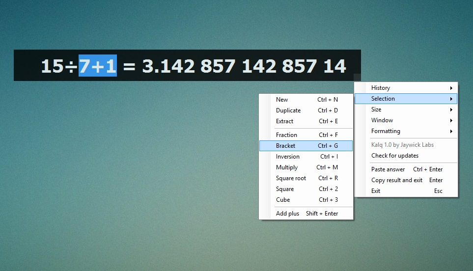

The Kalq Project
====
_A calculator for the rest of us_

Calculator software try too hard to imitate the real thing. They end up big and clunky and their limitations are carried on. Kalq is a user experience experiment to discover an elegant solution to everyday calculations.

## Project Home
Kalq is a **[Jay Wick Labs](http://labs.jay-wick.com/labs)** and the project home can be found at [http://labs.jay-wick.com/projects/kalq](http://labs.jay-wick.com/projects/kalq)

## Usage
You won't need a manual to figure it out, just start typing away! But to learn more and get the best out of this program have a glance at [Usage Guide](https://sites.google.com/a/jay-wick.com/kalq/usage "Kalq Usage Guide").

If pictures and reading bore you, then just check out the YouTube video: [http://youtu.be/8691ZsIkMJQ](http://youtu.be/8691ZsIkMJQ "Kalq demonstration video")

## Downloads
Go to [Releases](https://github.com/jaywick/kalq/releases) for the latest downloads!